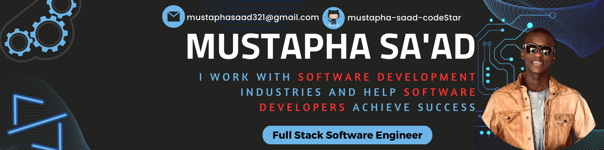

 
<!--
**mustapha-saad-codeStar/mustapha-saad-codeStar** is a ✨ _special_ ✨ repository because its `README.md` (this file) appears on your GitHub profile.

Here are some ideas to get you started:

- 🔭 I’m currently working on ...
- 🌱 I’m currently learning ...
- 👯 I’m looking to collaborate on ...
- 🤔 I’m looking for help with ...
- 💬 Ask me about ...
- 📫 How to reach me: ...
- 😄 Pronouns: ...
- ⚡ Fun fact: ...
-->

# ABOUT ME:
As a Quantum Software Engineer and a Machine Learning Engineer on a mission, I am eager to bring my unique blend of skills and expertise to your organization. 

My passion for science and technology drives me to push the boundaries of what is possible in the quantum and machine learning worlds.

With a deep understanding of quantum computing algorithms and circuit design, combined with my coding proficiency, particularly in Python, I am capable of designing and developing cutting-edge quantum systems that deliver real results. 

#### My experience with programming and quantum mechanics allows me to approach each project with a holistic perspective, ensuring that the end product is not only technically sound, but also practical and user-friendly.

In the realm of machine learning, I am equally proficient. 

I have a solid grasp of neural networks, deep learning, and natural language processing, and have honed my skills in model development using tools like TensorFlow and Keras. 

My expertise in data science and AI, combined with my problem-solving mindset, allows me to approach each project with a focus on finding the most efficient and effective solution.

I am a results-driven individual who is constantly seeking new challenges and opportunities for growth. 

My passion for science and technology, coupled with my skills and experience, makes me a valuable asset to any team. 

If you're seeking a Quantum Software Engineer and a Machine Learning Engineer who is ready to make a real impact, I am your ideal candidate. 

Let's work together to drive innovation and create meaningful solutions.

"Don't hesitate to message me so as to discuss how I can put my skills and experience to work for you."
